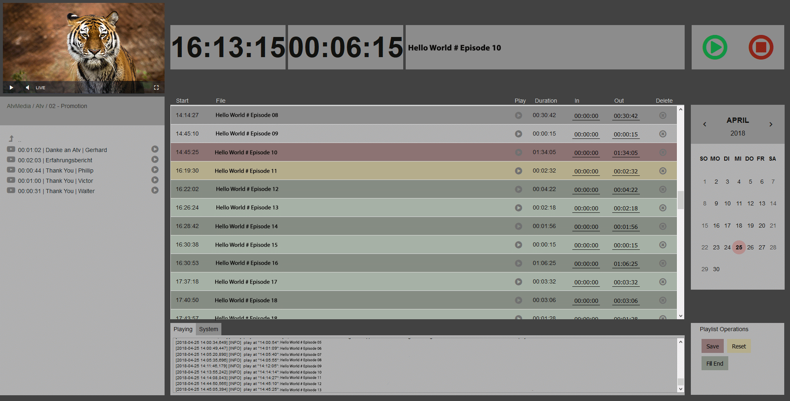

ffplayout-gui
=====

Web-based graphical user interface for [ffplayout-engine](https://github.com/ffplayout/ffplayout-engine).

**Warning:** This GUI is **not** made with security in mind. It have some potential risks and should only be used in local environments.

The GUI uses CSS Grid, so it only works in modern Browsers, in Internet Explorer 11 for example it will not work.

Minimum Screen Resolution is 1920*1080.

In some parts, like list_op.php the code is a bit messy. I use here formating options for our file names.

Help in code inprovements are very welcome!

ffplayout and ffplayout-gui is only tested on linux. My setup runs on debian, so the instruction is made for it to.

For previewing the clips, they must have a format what video.js can read. I use here h264/aac/mp4.

Used Modules:
-----
- https://github.com/RubaXa/Sortable
- https://github.com/DirectoryLister/DirectoryLister
- https://github.com/KennethanCeyer/pg-calendar
- https://github.com/videojs
- https://github.com/videojs/videojs-contrib-hls
- https://github.com/videojs/videojs-flash
- http://jquery.com/
- https://jqueryui.com/
- https://momentjs.com/

Installation:
----
- ffplayout should be setup already
- install a webserver with php support (Apache or nginx)
- install [srs](https://github.com/ossrs/srs) or something similar for previewing your stream (example for srs you found in the wiki)
- we need some visudo entries:
  - www-data ALL = NOPASSWD: /bin/systemctl start srs, /bin/systemctl stop srs, /bin/systemctl status srs
  - www-data ALL = NOPASSWD: /bin/systemctl start ffplayout, /bin/systemctl stop ffplayout, /bin/systemctl status ffplayout, /bin/journalctl -u ffplayout.service -n 1000
- place ffplayout-gui in your **www** folder and make it reachable for your network
- symlink your media folder to the root folder (the author from DirectoryLister don't recommend this way...):
  - ln -s /AtvMedia /var/www/ffplayout/
- the ffplayout-gui need read access to /etc/ffplayout/ffplayout.conf
- the gui needs also read access to the ffplayout log file
- that's it

I hope the GUI is self explaining, when not I can write something to for it.
