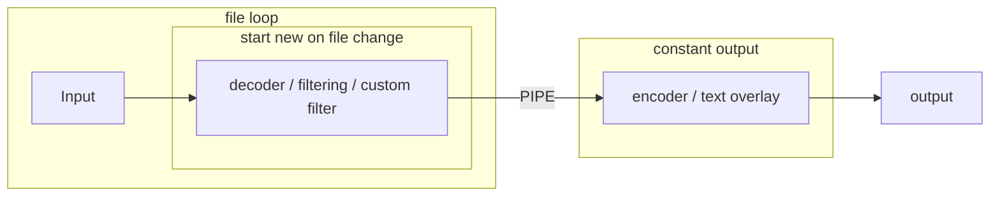

## Custom filter

ffplayout allows the definition of a custom filter string. For this, the parameter **custom_filter** is available in the playout configuration under **processing**. The playlist can also contain a **custom_filter** parameter for each clip, with the same usage.

The filter outputs should end with `[c_v_out]` for video filters and `[c_a_out]` for audio filters. The filters will be applied to every clip and after the filters that unify the clips.

It is possible to apply only video filters, only audio filters, or both. For a better understanding, here are some examples:

#### Apply Gaussian blur and volume filter:

```YAML
custom_filter: "gblur=5[c_v_out];volume=0.5[c_a_out]"
```

#### Apply loudnorm filter:

```YAML
custom_filter: "loudnorm=I=-18:TP=-1.5:LRA=11[c_a_out]"
```
#### Dynamic Audio Normalizer | Compressor | Limiter
This filter should be used in preference to the loudnorm filter.

```YAML
custom_filter: "dynaudnorm=f=200:g=15,acompressor=threshold=0.2:ratio=4:attack=20:release=250:knee=2.5,alimiter=level_in=1.0:limit=0.9:level_out=0.95:release=50[c_a_out]"
```

#### Add lower third:

```YAML
custom_filter: "[v_in];movie=/path/to/lower_third.png:loop=0,scale=1024:576,setpts=N/(25*TB)[lower];[v_in][lower]overlay=0:0:shortest=1[c_v_out]"
```

#### Overlay current time:

```YAML
custom_filter: "drawtext=text='%{localtime\:%H\\\:%M\\\:%S}':fontcolor=white:fontsize=40:x=w-tw-20:y=20:box=1:boxcolor=red@0.7:boxborderw=10[c_v_out]"
```

#### Scrolling text with static background:

```YAML
custom_filter: "drawbox=x=0:y=in_h-(in_h/6):w=in_w:h=60:t=fill:color=#000000@0x73,drawtext=text='Hello World':x='ifnot(ld(1),st(1,t));if(lt(t,ld(1)+1),w+4,w-w/12*mod(t-ld(1),12*(w+tw)/w))':y='main_h-(main_h/6)+20':fontsize=24:fontcolor=#f2f2f2"
```

Pay attention to the filter prefix `[v_in];`, this is necessary to get the output from the regular filters.

#### Paint effect

```YAML
custom_filter: "edgedetect=mode=colormix:high=0[c_v_out]"
```

### Where the filters applied in stream mode

The **custom filter** from **config -> processing** and from **playlist** got applied in the _decoder_ instance on every file:




#### When take which

* If you want to use for every clip a different filter chain, you should use the custom filter parameter from **playlist**.
* When you want to use the same filter for every clip you can use the custom filter from **config -> processing**.

### Complex example

This example takes a image and a animated mov clip with alpha and overlays them two times on different positions in time:

```YAML
custom_filter: "[v_in];movie=image_input.png:s=v,loop=loop=250.0:size=1:start=0,scale=1024:576,split=2[lower_1_out_1][lower_1_out_2];[lower_1_out_1]fifo,fade=in:duration=0.5:alpha=1,fade=out:start_time=9.5:duration=0.5:alpha=1,setpts=PTS+5.0/TB[fade_1];[v_in][fade_1]overlay=enable=between(t\,5.0\,15.0)[base_1];[lower_1_out_2]fifo,fade=in:duration=0.5:alpha=1,fade=out:start_time=9.5:duration=0.5:alpha=1,setpts=PTS+30.0/TB[fade_2];[base_1][fade_2]overlay=enable=between(t\,30.0\,40.0)[base_2];movie=animated_input.mov:s=v,scale=1024:576,split=2[lower_2_out_1][lower_2_out_2];[lower_2_out_1]fifo,setpts=PTS+20.0/TB[layer_1];[base_2][layer_1]overlay=repeatlast=0[base_3];[lower_2_out_2]fifo,setpts=PTS+50.0/TB[layer_2];[base_3][layer_2]overlay=repeatlast=0[c_v_out]"
```

And here are the explanation for each filter:

```PYTHON
# get input from video
[v_in];

# load the image, loops it for 10 seconds (25 FPS * 10), scale it to the target resolution, splits it into two outputs
movie=image_input.png:s=v,loop=loop=250.0:size=1:start=0,scale=1024:576,split=2[lower_1_out_1][lower_1_out_2];

# take output one from image, fades it in for 0.5 seconds, fades it out for 0.5 seconds, shift the start time to 00:00:05 (5 seconds)
[lower_1_out_1]fifo,fade=in:duration=0.5:alpha=1,fade=out:start_time=9.5:duration=0.5:alpha=1,setpts=PTS+5.0/TB[fade_1];

# overlay first output on top of the video, between second 5 and 15
[v_in][fade_1]overlay=enable=between(t\,5.0\,15.0)[base_1];

# take output two from image, fades it in for 0.5 seconds, fades it out for 0.5 seconds, shift the start time to 00:00:30 (30 seconds)
[lower_1_out_2]fifo,fade=in:duration=0.5:alpha=1,fade=out:start_time=9.5:duration=0.5:alpha=1,setpts=PTS+30.0/TB[fade_2];

# overlay second output on top of output from last overlay, between second 30 and 40
[base_1][fade_2]overlay=enable=between(t\,30.0\,40.0)[base_2];

# load the animated clip with alpha, scale it to the target resolution, splits it into two outputs
movie=animated_input.mov:s=v,scale=1024:576,split=2[lower_2_out_1][lower_2_out_2];

# shift the start from first animated clip to second 20
[lower_2_out_1]fifo,setpts=PTS+20.0/TB[layer_1];

# overlay the shifted animation on top of the last image overlay
[base_2][layer_1]overlay=repeatlast=0[base_3];

# shift the start from second animated clip to second 50
[lower_2_out_2]fifo,setpts=PTS+50.0/TB[layer_2];

# overlay the second shifted animation on top of the last overlay
[base_3][layer_2]overlay=repeatlast=0[c_v_out]
```

Check ffmpeg [filters](https://ffmpeg.org/ffmpeg-filters.html) documentation, and find out which other filters ffmpeg has and how to apply.
